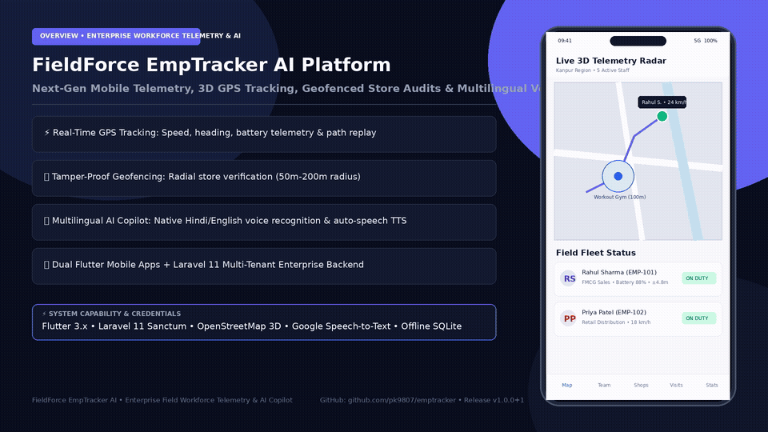

# 🚀 FieldForce EmpTracker AI
### Enterprise Field Workforce Tracking, Geofenced Shop Audit & Multilingual Voice AI Platform

[](https://flutter.dev)
[](https://laravel.com)
[](https://developer.android.com)
[](https://www.openstreetmap.org)
[](#)

---

## 🎬 Live Platform Demo Walkthrough & Feature Guide

<div align="center">
  
  <p><em>End-to-End Field Operations: Admin Command Center, 3D GPS Telemetry, Geofenced Visits & Multilingual AI Voice Assistant</em></p>
  <p><a href="docs/assets/fieldforce_platform_walkthrough.mp4">▶️ <b>Watch High-Definition Walkthrough MP4 Video (1080p Mobile Full HD)</b></a></p>
</div>

---

## 🔑 Demo Access Credentials

| Portal / App | Role | Demo Email | Password | Primary Capabilities |
|---|---|---|---|---|
| **Admin Command Center** | Operations Admin | `admin@fieldforce.com` | `Admin@123456` | 3D Live Telemetry Radar, Employee Management, Geofence Config, AI Operations Copilot |
| **Field Operations App** | Field Representative | `rahul@fieldforce.com` | `Emp@123456` | Shift Duty Toggle, Live GPS Sync, Geofenced Shop Check-in, Order Logging, AI Voice Assistant |

---

## 📋 Walkthrough Feature Breakdown

| Step | Portal | Feature Demonstrated | Details |
|---|---|---|---|
| **01** | **Admin App** | **Master Admin Login** | Multi-tenant RBAC login, ISO 27001 security, and offline mode fallback. |
| **02** | **Admin App** | **Live 3D GPS Telemetry** | Real-time map tracking of all field reps, speed, battery %, and breadcrumb trails. |
| **03** | **Admin App** | **AI Operations Copilot** | Multilingual voice queries in Hindi/English with real-time operational summaries. |
| **04** | **Admin App** | **Geofenced Retail Stores** | Store management, radius configuration (50m–200m), and visit compliance logs. |
| **05** | **Employee App** | **Mobile Rep Login** | Fast field executive authentication and daily territory sync. |
| **06** | **Employee App** | **Shift Off-Duty State** | Displays assigned stores (5 Shops), GPS readiness, and total distance tracked. |
| **07** | **Employee App** | **Start Duty & GPS Radar** | Background tracking activation with ±4.8m precision and live location pinging. |
| **08** | **Employee App** | **Assigned Shops & Radar** | Dynamic proximity calculations showing stores in geofence range (*0m away*). |
| **09** | **Employee App** | **Geofenced Shop Check-in** | Strict radial geofence validation, photo proof capture, order value & notes log. |
| **10** | **Employee App** | **Hands-Free Voice Copilot** | Speech-to-Text field voice input for rapid store reporting and task logging. |

---

## 📖 Project Overview

**EmpTracker (FieldForce AI)** is an enterprise-grade field employee telemetry, geofenced store auditing, live GPS tracking, and multilingual Voice AI assistant platform. 

It provides organizations, sales directors, and field operations managers with a comprehensive suite to track mobile workforce locations in real time, verify store visits with tamper-proof watermarked photos, manage geofenced attendance (Punch In / Punch Out), optimize travel routes, and interact with a conversational **Multilingual Voice AI Assistant** (supporting Hindi, Hinglish, and English).

---

## 🌟 Key Architecture & Features

### 🎙️ 1. Multilingual Voice AI Assistant (Speech-to-Text & Text-to-Speech)
- **Google Speech-to-Text Integration**: Tap the microphone (`🎙️`) to trigger Google Voice Recognition with native support for Indian accents in **Hindi (India)** and **English (India)**.
- **Real-Time Live Chatbox Streaming**: Spoken words are transcribed and populated directly into the chat input box (`Poochiye (Hindi, Hinglish, English)...`) in real time.
- **Visual 3-Second Auto-Send & Edit**: Displays an interactive countdown timer allowing users to review, edit, or immediately dispatch their voice commands.
- **Native Android Text-to-Speech (TTS)**: The AI responds in text and speaks the response aloud in natural Hindi or English.
- **Domain Guardrails & Out-of-Scope Protection**: Strict enterprise guardrails ensure the AI only answers operations queries (attendance, assigned shops, routes, team telemetry, visits) and politely declines non-work topics.

---

### 🗺️ 2. Live 3D Tracking & Map Intelligence Engine
- **Dual Map Engine Architecture**: Seamless one-tap switching between OpenStreetMap (Free / OSRM) and Google Maps 3D Live view.
- **Real-Time GPS Telemetry**: Monitors field staff battery level, movement speed, heading angle, and GPS accuracy with automatic offline fallback.
- **OSRM Intelligent Route Optimization**: Computes shortest travel paths and optimal visit sequences for multi-stop daily itineraries.
- **Nominatim Geocoding & Store Locator**: Fast spatial search for shops, supermarkets, medical stores, hotels, and custom geofences.

---

### 🏬 3. Geofenced Shop Visits & Proof Audit
- **Geofenced Verification**: Enforces minimum radial distance checks (50m - 200m) before an employee can mark a store visit.
- **Tamper-Proof Watermark Engine**: Automatically burns timestamp, staff name, GPS coordinates, and store name onto captured proof-of-visit camera photos.
- **Overdue & Stale Shop Prioritization**: Highlights unvisited or overdue outlets on the radar for immediate supervisor intervention.

---

### 👥 4. Dual Flutter Mobile Applications

#### A. Admin Command Center App (`apps/admin_app`)
- **Live 3D Radar Map**: Real-time multi-agent telemetry and field asset visualization.
- **Team Management**: Real-time staff duty roster, attendance logs, and route replay history.
- **Voice Commands**:
  - *"Active employees list dikhao"* (Show active employees)
  - *"Live radar shops check karo"* (Audit live radar shops)

#### B. Employee Field Operations App (`apps/employee_app`)
- **Daily Attendance**: Geofenced Punch In / Punch Out with location lock.
- **Assigned Stores**: Step-by-step visit checklist, order booking, and watermarked photo submission.
- **Voice Commands**:
  - *"Aaj ke pending shops dikhao"* (Show my pending shops today)
  - *"Mera next shop kaunsa hai"* (What is my next recommended visit?)

---

### 🔒 5. Enterprise Backend & Security
- **Laravel 11 RESTful API (`backend/`)**:
  - JWT / Sanctum bearer token authentication.
  - Multi-Org Tenant Isolation for secure data segregation.
  - 2-Step Authorization Guardrails (cryptographic confirmation tokens for write actions proposed by AI).
- **Offline-First Synchronization**: Local SQLite caching ensures field operations continue without interruption in low-connectivity areas.

---

## 🏗️ Repository Architecture

```
emptracker/
├── apps/
│   ├── admin_app/          # Flutter Admin Command Center Mobile Application
│   └── employee_app/       # Flutter Employee Field Operations Mobile Application
├── packages/
│   ├── core/               # Shared constants, API client, & utilities
│   ├── design_system/      # Enterprise UI widgets, AI Assistant Modal, User Guide
│   ├── firebase_repository/# Laravel REST API repository implementations
│   ├── location_engine/    # Background GPS tracking & geofencing engine
│   ├── map_engine/         # OSM + Google Maps, OSRM routing, & store locator
│   ├── models/             # Strongly-typed Dart domain models
│   └── services/           # Speech-to-Text, Native TTS, & Offline AI Engine
├── backend/                # Laravel 11 PHP Backend API & Local AI Engine
│   ├── app/AI/             # Domain Guardrails & Local Model Providers
│   ├── app/Http/           # REST Controllers (Location, Visit, Attendance, Shop)
│   └── database/           # Migrations & Seeders
└── docs/                   # System Architecture, AI Governance, & API Documentation
```

---

## 📱 Mobile Release Binaries

| Application | Platform | Binary Location |
|---|---|---|
| **Admin Command Center** | Android (API 26+) | [`downloads/emptracker-admin-release.apk`](file:///var/www/html/emptracker/downloads/emptracker-admin-release.apk) |
| **Employee Field App** | Android (API 26+) | [`downloads/emptracker-employee-release.apk`](file:///var/www/html/emptracker/downloads/emptracker-employee-release.apk) |

---

## 🚀 Setup & Execution Guide

### 1. Backend Setup (Laravel PHP)
```bash
cd backend
composer install
cp .env.example .env
php artisan key:generate
php artisan migrate --seed
php artisan serve --host=0.0.0.0 --port=8000
```

### 2. Flutter Mobile Apps Build
```bash
# Build Admin Application
cd apps/admin_app
flutter pub get
flutter build apk --release

# Build Employee Application
cd apps/employee_app
flutter pub get
flutter build apk --release
```

### 3. Run on Connected Android Device
```bash
# Run Admin App
cd apps/admin_app
flutter run -d <device-id>

# Run Employee App
cd apps/employee_app
flutter run -d <device-id>
```

---

## 🧪 Automated Testing

```bash
# Run AI and Services Test Suite
cd packages/services
flutter test test/ai_services_test.dart
```
✅ **11/11 Passing Tests**: Multilingual Detection, Offline AI Intent Engine, Native Speech & TTS Handlers, Strict Domain Guardrails.

---

## 📄 License
Copyright © 2026 EmpTracker / FieldForce Platform. All rights reserved.
Developed by Pradeep Kashyap ([@pk9807](https://github.com/pk9807)).
