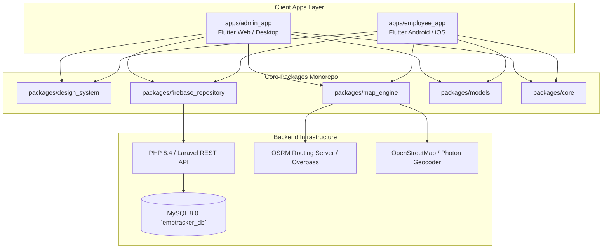
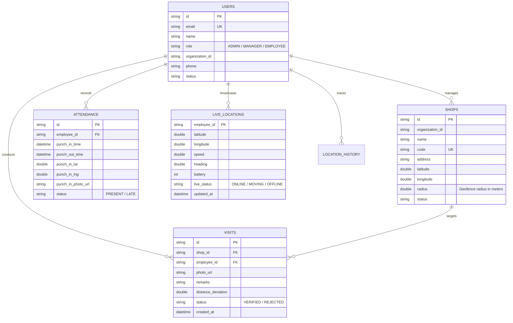
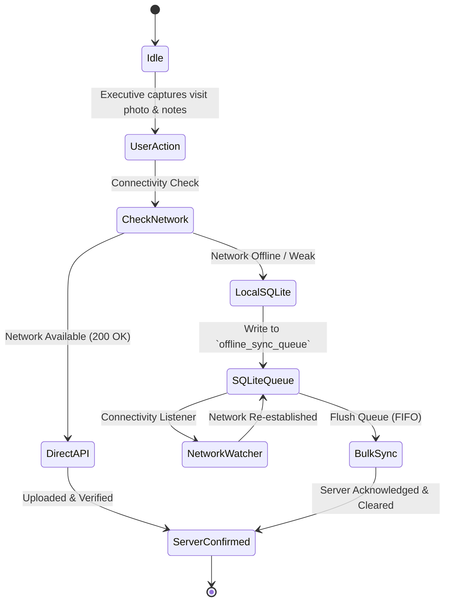

# 🏗️ FieldForce Pro (EmpTracker) — Deep-Dive Technical Architecture & Blueprint

> **Complete Engineering Specification, Algorithmic Models, API Contracts, Monorepo Architecture & Reproduction Guide**

---

## 🏛️ System Architecture Overview

FieldForce Pro is architected as a **Modular Monorepo** using Flutter (Dart 3) for multi-platform client applications and a robust, lightweight **REST API backend** powered by PHP 8.4 and MySQL.



---

## 📦 Monorepo Package Breakdown

| Package / App | Path | Primary Responsibilities |
| :--- | :--- | :--- |
| **`admin_app`** | `apps/admin_app` | Real-time 3D tracking map, field employee management, shop registration & geofencing, visit audits, attendance analytics, export reports. |
| **`employee_app`** | `apps/employee_app` | GPS attendance punch-in with selfie, nearest-shop proximity list, camera visit proof submission, offline sync queue, background telemetry. |
| **`map_engine`** | `packages/map_engine` | Dual map engines (`OsmLiveTrackingMapView` & `GoogleMapsLiveView`), `GooglePlaceDetailsPanel` with 5 action buttons, `UniversalSearchService`, `StoreLocatorEngine`, OSRM turn-by-turn routing. |
| **`firebase_repository`**| `packages/firebase_repository` | REST API dynamic repository layer (`LaravelAuthRepository`, `LaravelEmployeeRepository`, `LaravelShopRepository`, `LaravelVisitRepository`, `LaravelAttendanceRepository`, `LaravelLocationRepository`). |
| **`models`** | `packages/models` | Immutable data structures (`UserModel`, `ShopModel`, `EmployeeModel`, `VisitModel`, `AttendanceModel`, `LiveLocationModel`). |
| **`design_system`** | `packages/design_system` | Dark/Light themes, color tokens, typography, custom buttons, depth cards, glassmorphism overlays, and `UserGuideModal` (Multi-language role-aware help center). |
| **`core`** | `packages/core` | Date formatting utils, exceptions, network HTTP wrapper, constant keys. |

---

## 📐 Mathematical & Algorithmic Models

### 1. Haversine Distance & Proximity Engine (`StoreLocatorEngine`)
To sort shops and places nearest to the user without server lag, the app executes client-side Haversine computations:

$$\Delta\sigma = 2 \arcsin \sqrt{\sin^2\left(\frac{\Delta\phi}{2}\right) + \cos\phi_1 \cos\phi_2 \sin^2\left(\frac{\Delta\lambda}{2}\right)}$$
$$d = R \cdot \Delta\sigma \quad (R = 6371000\text{ meters})$$

```dart
// Location: packages/map_engine/lib/services/store_locator_engine.dart
static double calculateDistanceMeters(double lat1, double lon1, double lat2, double lon2) {
  const double earthRadiusMeters = 6371000.0;
  final dLat = _degreesToRadians(lat2 - lat1);
  final dLon = _degreesToRadians(lon2 - lon1);

  final a = math.sin(dLat / 2) * math.sin(dLat / 2) +
      math.cos(_degreesToRadians(lat1)) *
          math.cos(_degreesToRadians(lat2)) *
          math.sin(dLon / 2) *
          math.sin(dLon / 2);

  final c = 2 * math.atan2(math.sqrt(a), math.sqrt(1 - a));
  return earthRadiusMeters * c;
}
```

### 2. Multi-Token Fuzzy Search with Location Bias (`UniversalSearchService`)
Addresses Indian address variations (e.g. *"workout gym kanpur"*):
- Splits search query into normalized tokens (`['workout', 'gym', 'kanpur']`).
- Matches against local database cache first (+100 for exact name match, +25 for token overlap).
- Automatically queries Photon/Komoot Geocoder with geographic bias (`&lat=26.4832&lon=80.3184`).
- Computes Haversine distance and sorts suggestions strictly by **nearest first**.

---

## 🗄️ Database Architecture (`emptracker_db`)



---

## 🔌 REST API Specification

| Method | Route | Description | Request / Query | Response |
| :--- | :--- | :--- | :--- | :--- |
| `POST` | `/api/login` | Authenticate user & issue session token | `{ email, password }` | `{ token, user }` |
| `GET` | `/api/employees` | Fetch all organization employees | `?org_id=org_main` | `[ { id, name, status, ... } ]` |
| `GET` | `/api/shops` | Stream or list assigned shops with geofences | `?org_id=org_main` | `[ { id, name, latitude, longitude, radius } ]` |
| `POST` | `/api/shops` | Create/Register new shop with geofence | `{ name, address, latitude, longitude, radius }` | `{ status: 'success', shop }` |
| `POST` | `/api/visits` | Submit radial check-in visit with photo proof | `{ shop_id, employee_id, photo_url, lat, lng }` | `{ status: 'VERIFIED', visit_id }` |
| `POST` | `/api/attendance/punch-in` | Punch-in with GPS lock and selfie | `{ employee_id, lat, lng, photo_url }` | `{ status: 'PRESENT', record }` |
| `GET` | `/api/locations/stream` | Real-time telemetry feed of all field agents | `?org_id=org_main` | `[ { employee_id, lat, lng, speed, battery } ]` |
| `POST` | `/api/locations/update` | Mobile agent background GPS ping | `{ employee_id, lat, lng, speed, heading, battery }` | `{ status: 'OK' }` |
| `GET` | `/api/locations/history`| Turn-by-turn route coordinates for employee | `?employee_id=emp_1&date=2026-10-07` | `[ { lat, lng, timestamp } ]` |

---

## 🔄 Offline-First Synchronization Flow

For mobile field workers operating in low-connectivity areas:



---

## 🛠️ Step-by-Step Reproduction Guide (How to Rebuild from Scratch)

If you need to build this exact application from scratch in a new environment, follow these steps:

### Step 1: Initialize Flutter Monorepo
```bash
mkdir emptracker && cd emptracker
mkdir apps packages
cd packages
flutter create --template=package core
flutter create --template=package design_system
flutter create --template=package models
flutter create --template=package firebase_repository
flutter create --template=package map_engine
cd ../apps
flutter create --platforms=web,android admin_app
flutter create --platforms=android,ios employee_app
```

### Step 2: Configure Inter-Package Dependencies
In `apps/admin_app/pubspec.yaml` and `apps/employee_app/pubspec.yaml`, add local paths:
```yaml
dependencies:
  core: { path: ../../packages/core }
  design_system: { path: ../../packages/design_system }
  models: { path: ../../packages/models }
  firebase_repository: { path: ../../packages/firebase_repository }
  map_engine: { path: ../../packages/map_engine }
  flutter_map: ^7.0.2
  google_maps_flutter: ^2.18.1
  latlong2: ^0.9.1
```

### Step 3: Database & Backend Setup
1. Create MySQL database:
   ```sql
   CREATE DATABASE emptracker_db CHARACTER SET utf8mb4 COLLATE utf8mb4_unicode_ci;
   ```
2. Execute the table schemas defined in [Database Architecture](#database-architecture-emptracker_db).
3. Set up the PHP REST API endpoints matching [REST API Specification](#rest-api-specification).

### Step 4: Build & Deploy Clients
```bash
# Build Admin Command Center Web bundle
cd apps/admin_app
flutter build web --base-href "/emptracker/admin/" --output /var/www/html/emptracker/admin/

# Build Employee Web Emulator
cd ../employee_app
flutter build web --base-href "/emptracker/employee/" --output /var/www/html/emptracker/employee/

# Build Release APK for Android Devices
flutter build apk --release
```

---

## 🔒 Security & Compliance
- **ISO 27001 & Multi-Org Tenant Isolation**: Every SQL query is strictly parameterized and filtered by `organization_id`.
- **Anti-GPS Spoofing**: Checks `isMockLocation` flag on Android devices to reject fake GPS emulator apps.
- **Biometric / Camera Tamper Protection**: Photo submissions require direct camera sensor timestamps, preventing gallery photo re-uploads.
