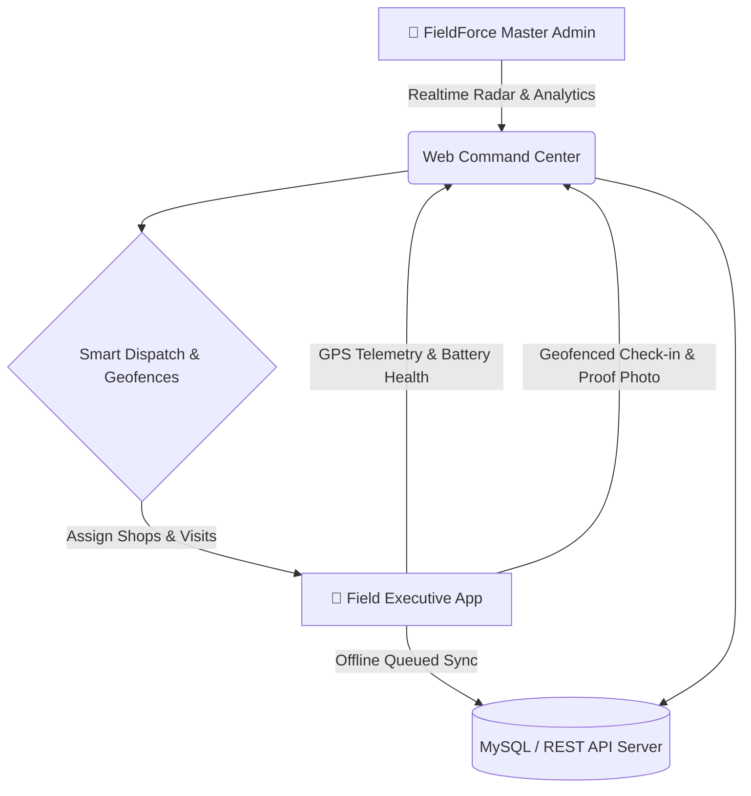
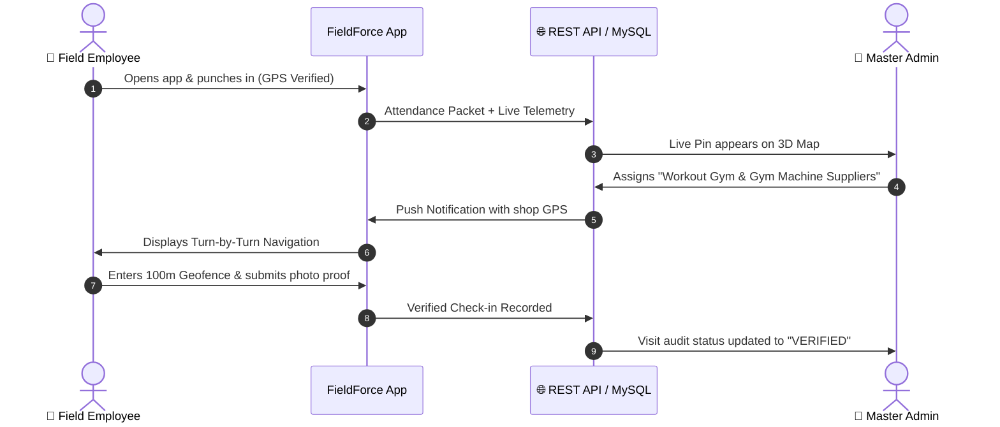

# 📱 FieldForce Pro (EmpTracker) — Complete Product & User Guide

> **Enterprise Real-Time Field Employee Tracking, Geofence Attendance, Shop Route Navigation & Field Visit Audit Platform**

---

## 🎯 Executive Summary & Value Proposition

**FieldForce Pro** is an enterprise-grade mobile & web platform designed for organizations with on-ground field forces — such as sales representatives, delivery personnel, field technicians, medical representatives, and inspection officers.

It solves the major pain points of field workforce management:
- ❌ **Buddy punching & false attendance** ➡️ Solved via **GPS-locked Geofenced Selfie Punch-in**.
- ❌ **Fake customer/shop visits** ➡️ Solved via **Geofence Radial Verification + Camera Proof**.
- ❌ **Unmonitored travel & idle time** ➡️ Solved via **Real-Time GPS Telemetry + Turn-by-Turn Route History**.
- ❌ **Manual shop navigation & dispatch** ➡️ Solved via **Google Maps / OSM Multi-Engine Live Map with 1-Click Directions & Dispatch**.
- ❌ **Connectivity drops in rural areas** ➡️ Solved via **Offline-First SQLite Cache with Auto-Sync Engine**.



---

## 👥 User Personas & Workflows

### 1. 🏢 Administrator / Field Manager (Web Portal)
- **Live 3D Radar Map**: Real-time tracking of all field executives across cities with battery %, speed, and connectivity health.
- **Shop & Place Intelligence**: Search any shop, landmark, or category (e.g. *"Workout Gym Kanpur"*), view Google Maps style Place Details with photos, reviews, and opening hours.
- **Turn-by-Turn Directions**: Instant route computation between field agents and target client locations.
- **1-Click Dispatch ("Send to Phone")**: Push target client/shop directly to a field employee's mobile app.
- **Geofence Management**: Define custom radius (e.g. 100m, 200m) around client locations to ensure executives are physically present.
- **Visit & Proof Audit**: Review check-in timestamps, GPS coordinates, distance deviation, and live photos uploaded by agents.
- **Attendance & Route History**: Export daily distance traveled, active vs idle hours, and attendance summaries to Excel/PDF.

### 2. 🚶 Field Representative / Sales Executive (Mobile Android App)
- **1-Tap Face & GPS Attendance**: Punch-in only when physically inside the designated territory or office.
- **Assigned Shops Directory**: Instant list of assigned clients sorted by proximity (nearest first).
- **In-App Navigation**: Integrated turn-by-turn routing to reach target shops efficiently.
- **Radial Check-in & Visit Verification**: Seamless check-in validation when arriving within shop geofence radius.
- **Order & Proof Submission**: Capture store front photo, log notes, collect digital signatures, and submit visit reports.
- **Offline Mode**: Work uninterrupted in basements or remote rural zones without internet; all submissions sync automatically upon reconnecting.

---

## 🗺️ Google Maps Style Place Intelligence & Actions

FieldForce Pro replicates the complete Google Maps Place Details experience directly inside the enterprise command center:

```
┌────────────────────────────────────────────────────────┐
│  [Cover Photo: Gym Machinery / Storefront]      [✕]    │
│                                                        │
│  Workout Gym & Gym Machine Suppliers                   │
│  वर्कआउट जिम & जिम मशीन सप्लायर्स                       │
│  4.8 ★★★★★ (348) • Exercise equipment store            │
│                                                        │
│  [Overview]          [Reviews]          [About]        │
│                                                        │
│   ( 🧭 )      ( 🔖 )      ( 🎯 )      ( 📱 )    ( 🔗 )  │
│ Directions     Save       Nearby      Send to   Share  │
│                                       Phone            │
│                                                        │
│  ✓ In-store shopping  ✓ In-store pick-up  ✓ Delivery   │
│  🕒 Open • Closes 9:00 PM                              │
│  📍 7/17A, Parwati Bagla Rd, Tilak Nagar, Kanpur       │
└────────────────────────────────────────────────────────┘
```

### Action Buttons Explained:
1. **🧭 Directions**: Draws interactive OSRM/Google turn-by-turn route polylines from the nearest employee to the shop.
2. **🔖 Save**: Bookmarks the store for quick recall in customized field lists.
3. **🎯 Nearby**: Automatically filters and highlights adjacent registered shops and services within a 2km radius.
4. **📱 Send to phone**: Instantly dispatches the shop coordinate and customer contact details to the field agent's phone.
5. **🔗 Share**: Generates sharable universal Google Maps & FieldForce coordinates.

---

## 🔄 Core End-to-End Workflows

### Workflow A: Morning Attendance & Duty Activation
1. Executive opens **FieldForce Mobile App**.
2. GPS validates executive location against allowed geofence.
3. Executive snaps live verification selfie and taps **Punch In**.
4. Telemetry background daemon starts streaming battery-efficient location packets to the Admin Command Center.

### Workflow B: Client Visit Execution
1. Executive opens **Assigned Shops** tab. The app sorts shops by nearest distance using local **Haversine Proximity**.
2. Executive taps **Navigate** to open turn-by-turn route.
3. Upon arrival within the shop's 100m geofence radius, the **Check-in** button activates with a green badge.
4. Executive captures visit photo, types summary notes, and hits **Submit Proof**.
5. Admin instantly sees green verification badge on the live dashboard.



---

## 🌐 In-App Multi-Language Interactive User Guide (बहुभाषी मार्गदर्शिका)

Both the **Admin Command Center** and **Field Employee App** now feature an integrated **User Guide Modal** with real-time role switching and multi-language support.

### Supported Languages:
- 🇮🇳 **Hinglish** (Default conversational Hindi + English)
- 🇮🇳 **हिंदी (Hindi)**
- 🇳🇵 **नेपाली (Nepali)**
- 🇮🇳 **मराठी (Marathi)**
- 🇮🇳 **বাংলা (Bengali)**
- 🇮🇳 **தமிழ் (Tamil)**
- 🇬🇧 **English (Global)**

### How to Access:
- **Admin**: Click the **`User Guide (मार्गदर्शिका)`** button in the top navigation bar or the left sidebar above the user profile.
- **Employee**: Tap the **`📖 (User Guide)`** icon in the top app bar on the mobile screen.
- **Features**: Real-time topic search, interactive role toggling (Admin ⟷ Employee), visual cards, and actionable pro-tips.

---

## 📊 Business ROI & Measurable Impact

| Metric | Before FieldForce Pro | With FieldForce Pro | Impact |
| :--- | :--- | :--- | :--- |
| **Field Fuel Expenses** | Unverified claims based on odometer estimates | Exact GPS turn-by-turn polyline distance tracking | **25% - 35% Cost Reduction** |
| **Visit Authenticity** | Manual log sheets with no physical proof | Geofenced radial check-in + camera photo timestamps | **100% Visit Verification** |
| **Daily Visits per Agent** | 4 – 5 visits / day due to poor routing | 8 – 10 visits / day with Proximity-Sorted lists | **+80% Productivity Surge** |
| **Admin Audit Time** | 2 hours/day sorting paper receipts | Instant automated daily summary exports (Excel/PDF) | **90% Time Saved** |

---

## 🌐 Quick Access Links

- **Admin Web Command Center**: [http://localhost/emptracker/admin/](http://localhost/emptracker/admin/)
- **Employee Web Emulator**: [http://localhost/emptracker/employee/](http://localhost/emptracker/employee/)
- **Android APK Downloads**: [http://localhost/emptracker/downloads/](http://localhost/emptracker/downloads/)
