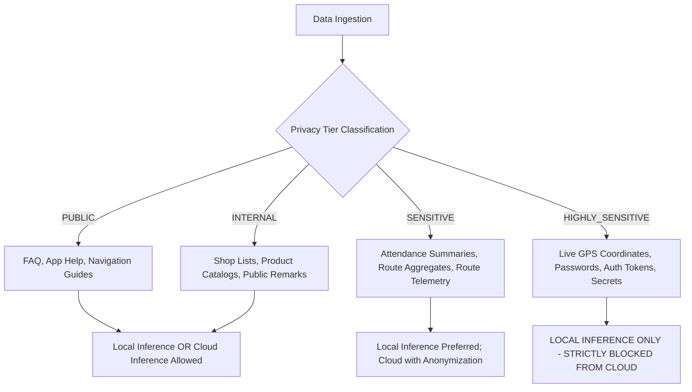
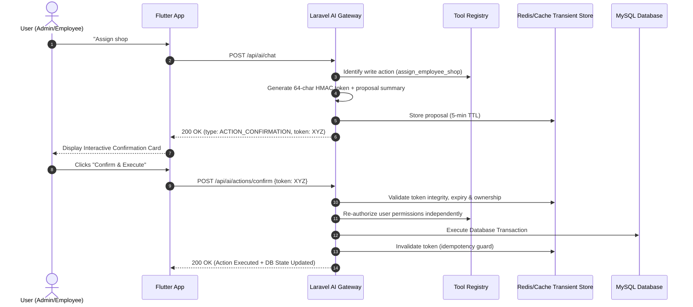

# EmpTracker AI Governance & Operational Safety Policy

**Document Status:** Approved & Production-Enforced  
**Scope:** FieldForce EmpTracker Enterprise Platform (Backend, Mobile, Web, AI Gateway)  
**Standard:** Local-First Privacy & Zero-Autonomous-Action Architecture

---

## 1. Purpose & Guiding Principles

EmpTracker AI is engineered as an **assistive, operational intelligence and telemetry interpretation layer**. It transforms raw tracking data into actionable insights for field workforce management.

### The 4 Foundational Invariants:
1. **AI is NEVER the Source of Truth:** Relational database records (MySQL), GPS telemetry streams, verified attendance punches, and deterministic business calculations remain the sole source of truth.
2. **Zero Autonomous Business Mutations:** The AI may detect, summarize, prioritize, predict, and recommend, but **MUST NEVER** execute database writes or business actions without explicit, interactive human confirmation.
3. **Local-First Privacy by Design:** All inference executes on local embedded engines (`Qwen2.5-1.5B / Gemma2-2B`) by default. Highly sensitive GPS coordinates and personal telemetry never leave the enterprise boundary.
4. **Independent Authorization & Defense-in-Depth:** Every AI tool independently authenticates, authorizes against user roles, validates inputs, and isolates tenant data before execution.

---

## 2. Capabilities Matrix: Allowed vs. Prohibited

| Category | Capability | Status | Governance Rule |
| :--- | :--- | :---: | :--- |
| **Telemetry & Map** | Live agent location inspection | **ALLOWED** | Enforces RBAC; employee can only inspect self; admin inspects territory. |
| **Telemetry & Map** | Route summarize & distance calculation | **ALLOWED** | Uses verified GPS logs and Haversine spatial calculations. |
| **Telemetry & Map** | Overdue shop identification | **ALLOWED** | Deterministic SQL calculation ($\ge 7$ days threshold). |
| **Telemetry & Map** | Next visit recommendation | **ALLOWED** | Ranked by spatial proximity and unvisited age. |
| **Proactive Signals**| Operational anomaly detection | **ALLOWED** | Detects stationary idle periods ($\ge 30$ min) and attendance gaps. |
| **Proactive Signals**| Executive daily summary generation | **ALLOWED** | Admin only; summarizes risk signals without raw PII exposure. |
| **State Modifications**| Shop assignment to employee | **RESTRICTED**| Requires **Phase 4 Two-Step Cryptographic Confirmation**. |
| **State Modifications**| Urgent shop note creation | **RESTRICTED**| Requires **Phase 4 Two-Step Cryptographic Confirmation**. |
| **State Modifications**| Autonomous employee termination | **PROHIBITED**| Strictly barred from AI capabilities. |
| **State Modifications**| Autonomous attendance alteration | **PROHIBITED**| Strictly barred; attendance punches require physical app biometric/GPS check-in. |
| **Inference** | Direct SQL generation | **PROHIBITED**| No arbitrary SQL generated by AI; tools use parameter-bound Eloquent models. |
| **Inference** | Cloud transmission of live GPS | **PROHIBITED**| Privacy Gate strictly blocks cloud fallback for `HIGHLY_SENSITIVE` data. |

---

## 3. Data Classification & Privacy Tiers

All data within EmpTracker is classified into 4 distinct privacy tiers:



### Sanitization & PII Redaction
- All payloads passed to language models undergo PII redaction via [`AiDataSanitizer.php`](file:///var/www/html/emptracker/backend/app/AI/Services/AiDataSanitizer.php).
- Auth tokens, passwords, bearer secrets, and confirmation tokens are stripped with `[REDACTED_SECRET]`.

---

## 4. Local-First Routing & Cloud Fallback Policy

```
[User Request]
       │
       ▼
[AiRouter::routeTools]
       │
       ▼
[Privacy Gate Classification]
       │
       ├── HIGHLY_SENSITIVE ──► [Local AI Engine ONLY] (Cloud Fallback Blocked)
       │
       └── INTERNAL / PUBLIC
                 │
                 ├── Local Available ──► [Local AI Engine]
                 │
                 └── Local Unavailable ──► [Cloud Fallback (Gemini/OpenAI)]
```

### Explicit Fallback Reasons:
Cloud fallback triggers ONLY with documented reason codes:
- `LOCAL_MODEL_UNAVAILABLE`: Local engine is offline or disabled in environment.
- `LOCAL_MODEL_UNSUPPORTED`: Requested multimodal capability not supported locally.
- `CONTEXT_TOO_COMPLEX`: Context size exceeds local token limit (2048 tokens).
- `LOCAL_INFERENCE_FAILURE`: Local engine crashed or returned invalid format.
- `USER_POLICY_ALLOWED`: User specifically requested cloud synthesis and privacy allows.

---

## 5. Write Action Governance (Two-Step Confirmation)



---

## 6. Model Registry & Versioning

All models are centralized in [`AiModelRegistry.php`](file:///var/www/html/emptracker/backend/app/AI/Services/AiModelRegistry.php) and configured via environment flags (`AI_LOCAL_MODEL`, `AI_CLOUD_PROVIDER`):

- **Local Default:** `qwen2.5-1.5b-instruct-q4` (Quantization: `Q4_K_M`, Target: CPU/NPU, Latency: <150ms).
- **Local Secondary:** `gemma-2-2b-it-q4` (Quantization: `Q4_K_M`).
- **Cloud Fallback:** `gemini-1.5-flash` / `gpt-4o-mini`.

---

## 7. Audit Logging & Retention

1. **Audit Logs:** Every AI interaction is recorded in `ai_audit_logs` including `user_id`, `request_message`, `response_type`, `tools_executed`, `provider_used`, `latency_ms`, and `privacy_tier`.
2. **PII Isolation in Logs:** Request and response texts in audit tables are sanitized; credentials and tokens are scrubbed.
3. **Retention Policy:** Operational audit records are retained for 90 days for compliance audits.

---

## 8. Incident Response & Master Killswitch

In the event of an AI anomaly or unexpected behavior:
1. **Master Feature Flag:** Set `AI_ENABLED=false` in `.env`.
   - AI endpoints immediately return HTTP 503 (`AiDisabledException`).
   - Core FieldForce tracking, live radar, attendance check-ins, and shop visits remain **100% operational without interruption**.
2. **Cloud Fallback Killswitch:** Set `AI_CLOUD_FALLBACK_ENABLED=false` to immediately lock all operations to local on-premise execution.
