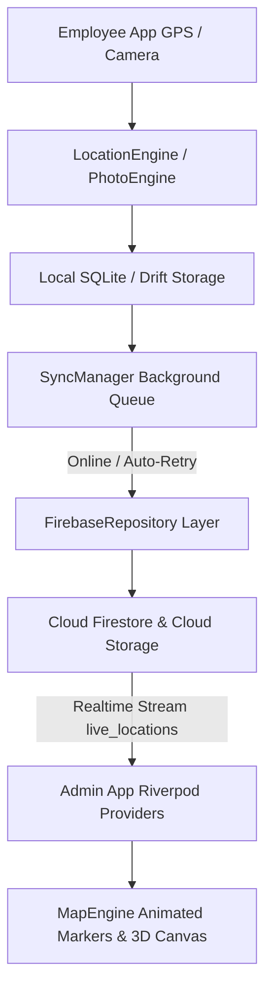

# SYSTEM ARCHITECTURE

## 1. Monorepo Architecture Overview
```
emptracker/
├── apps/
│   ├── employee_app/          # Flutter Mobile App for Field Employees
│   └── admin_app/             # Flutter Web & Responsive Admin Dashboard
├── packages/
│   ├── core/                  # Common primitives, constants, exceptions, network info, date utils
│   ├── models/                # Domain entities, JSON serializable DTOs, Freezed models
│   ├── services/              # Storage, sync manager, notification handler, watermark engine
│   ├── design_system/         # Color tokens, typography, 3D cards, badges, buttons, themes
│   ├── firebase_repository/   # Firestore, Auth, Storage, FCM abstraction repositories
│   ├── location_engine/       # Foreground service, GPS filtering, battery optimization, geofencing
│   └── map_engine/            # Google Maps controllers, custom animated markers, polyline routing
└── docs/                      # Comprehensive technical documentation & specifications
```

## 2. Layered Architecture (Clean Architecture + Riverpod)
Each app and package adheres to strict boundary separation:
1. **Presentation Layer:** Riverpod StateNotifiers / AsyncNotifiers, Widgets, Pages, Dialogs, Bottom Sheets. No direct Firestore calls in widgets.
2. **Domain Layer:** Models, Entities, Value Objects, Business Rules, Geofence validators.
3. **Application / Engine Layer:** `LocationEngine`, `MapEngine`, `VisitEngine`, `PhotoEngine`, `SyncManager`.
4. **Data Layer (Repositories):** `AuthRepository`, `EmployeeRepository`, `ShopRepository`, `VisitRepository`, `AttendanceRepository`, `LocationRepository`.
5. **Data Sources:** Firestore Data Source, Local SQLite/Drift Data Source, Firebase Storage Data Source.

## 3. Communication & Data Flow

