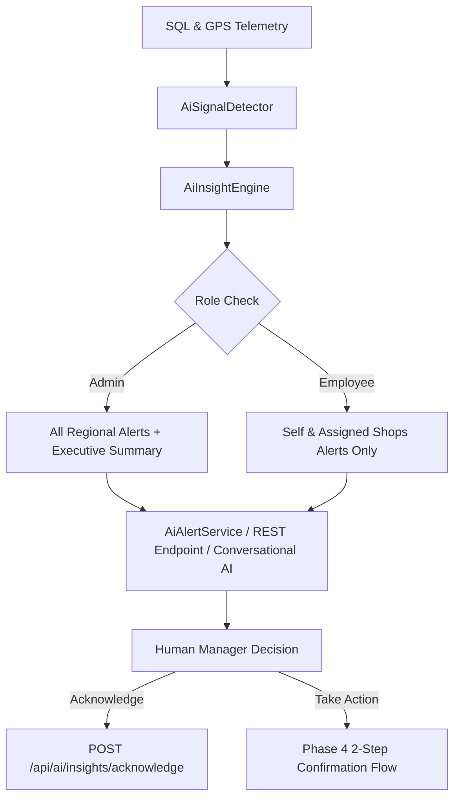

# Phase 7: Proactive AI Agent, Predictive Intelligence, Alerts & Management Insights

## 1. Executive Summary
Phase 7 elevates EmpTracker from a purely conversational and reactive query assistant into a **controlled, proactive operational intelligence system**.

### Key Architectural Invariants
1. **AI is NEVER the Source of Truth:** Telemetry facts, relational databases (MySQL), deterministic spatial calculations, and business rules remain the sole ground truth. AI serves purely as an interpretation, prioritization, and natural language communication layer.
2. **Zero Autonomous Business Execution:** The AI may detect, summarize, prioritize, predict, and recommend, but **MUST NEVER** execute sensitive business actions (shop assignments, notes, status changes) without explicit human confirmation (Phase 4 Two-Step Confirmation System).
3. **Deterministic Signals & Thresholds:** Signals are computed using explicit rules and configurable parameters defined in `config/ai.php`.
4. **Role-Based Isolation (RBAC):** Admins receive whole-territory alerts and daily executive summaries; field employees receive scoped alerts only for themselves and assigned shops.

---

## 2. Signal & Telemetry Detection Engine

Signals are computed deterministically by [AiSignalDetector.php](file:///var/www/html/emptracker/backend/app/AI/Services/AiSignalDetector.php):

| Signal Code | Entity | Threshold Configuration | Severity Mapping |
| :--- | :--- | :--- | :--- |
| `SHOP_OVERDUE` | Shop | `config('ai.proactive.shop_overdue_days', 7)` | $\ge 21\text{ days} \to \text{CRITICAL}$, $\ge 14\text{ days} \to \text{HIGH}$, $\ge 7\text{ days} \to \text{MEDIUM}$ |
| `EMPLOYEE_IDLE_TOO_LONG` | Employee | `config('ai.proactive.idle_threshold_minutes', 30)` | $\ge 60\text{ min} \to \text{HIGH}$, $\ge 30\text{ min} \to \text{MEDIUM}$ |
| `MISSING_ATTENDANCE` | Employee | Current day 00:00 - 23:59 | `LOW` |

---

## 3. Insight Engine & Alert Lifecycle

[AiInsightEngine.php](file:///var/www/html/emptracker/backend/app/AI/Services/AiInsightEngine.php) orchestrates signals, ranks severity, deduplicates notifications, and manages alert state transitions:

### Alert States
- `DETECTED` $\to$ Signal discovered in current telemetry pass.
- `ACTIVE` $\to$ Displayed in proactive feeds / prompt chips.
- `ACKNOWLEDGED` $\to$ Confirmed by manager; muted for 24 hours.
- `RESOLVED` $\to$ Condition resolved in database (e.g. store visited or attendance punched).
- `DISMISSED` $\to$ Muted explicitly by administrator.

---

## 4. Registered AI Tools in Phase 7

Tool Registry expanded to **19 production tools**:

| Category | Tool Name | Role | Sensitivity | Description |
| :--- | :--- | :--- | :--- | :--- |
| **Proactive** | `get_proactive_insights` | Employee / Admin | `INTERNAL` | Retrieves ranked operational signals and risk alerts filtered by RBAC. |
| **Proactive** | `get_daily_operational_summary` | Admin | `SENSITIVE` | Generates high-level executive operational status and priority breakdown. |
| **Map** | `get_overdue_shops` | Employee / Admin | `INTERNAL` | Lists retail stores unvisited for $\ge 7$ days. |
| **Map** | `get_next_shop_recommendation` | Employee | `INTERNAL` | Calculates next optimal visit by spatial distance and priority. |
| **Map** | `get_employee_route_summary` | Employee / Admin | `SENSITIVE` | Summarizes route distance, visited vs pending stops, and idle periods. |
| **Map** | `get_area_coverage_summary` | Admin | `SENSITIVE` | Calculates regional visit density and unvisited shop ratios. |
| **Write** | `assign_employee_shop` | Admin | `INTERNAL` | Proposes shop reassignment with 2-step confirmation. |
| **Write** | `add_shop_urgent_note` | Employee / Admin | `INTERNAL` | Appends timestamped urgent remarks to store file. |
| **Write** | `record_visit_remark` | Employee | `INTERNAL` | Attaches operational remarks to field visits. |
| **Read** | `search_employees`, `get_employee_profile`, `get_employee_location`, `get_employee_attendance`, `get_employee_visits`, `search_shops`, `get_shop_details`, `get_shop_visits`, `get_nearby_shops`, `get_today_route` | All | `INTERNAL` / `HIGHLY_SENSITIVE` | Foundational query tools. |

---

## 5. API Endpoints

1. **`GET /api/ai/insights`** (Sanctum Authenticated)
   - Fetches role-filtered active proactive insights for the current user.
2. **`GET /api/ai/insights/summary`** (Admin Only)
   - Fetches calculated executive summary status and severity counts.
3. **`POST /api/ai/insights/acknowledge`** (Sanctum Authenticated)
   - Body: `{"alert_id": "shop_overdue_1", "action": "ACKNOWLEDGED"}`
   - Updates alert state with timestamp and user attribution.
