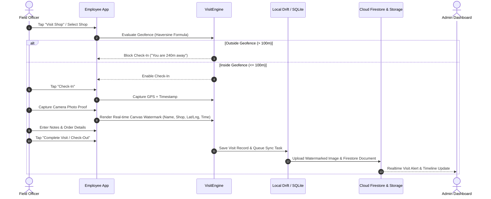

# SHOP & OFFICE VISIT MANAGEMENT SYSTEM

## 1. End-to-End Visit Lifecycle

## 2. Geofence Calculation (Haversine Formula)
Client-side and Cloud-side verification uses the standard spherical distance formula:
$$d = 2r \arcsin\left(\sqrt{\sin^2\left(\frac{\Delta \phi}{2}\right) + \cos(\phi_1)\cos(\phi_2)\sin^2\left(\frac{\Delta \lambda}{2}\right)}\right)$$
where $r = 6371000$ meters.

## 3. Watermarking Specification
When photo proof is captured:
- **Canvas Overlay:** Bottom 20% darkened banner with high contrast typography.
- **Embedded Details:**
  - Organization Name / App Header
  - Shop Name & Code
  - Employee Full Name & Employee Code
  - Human Readable Date & Local Time (IST/UTC)
  - Exact GPS Latitude & Longitude with Accuracy Radius
- Both high-res watermarked original and 200x200 compressed thumbnail are generated.
